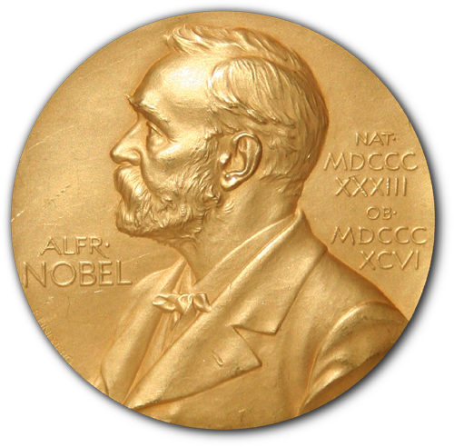

# The most Nobel of Prizes

## Introduction
This is a fourth project (guided) on DataCamp Project Data Scientist Career Track (Perpared for Certificate).\
The Nobel Prize is perhaps the world's most well known scientific award. Except for the honor, prestige and substantial prize money the recipient also gets a gold medal showing Alfred Nobel (1833 - 1896) who established the prize. Every year it's given to scientists and scholars in the categories chemistry, literature, physics, physiology or medicine, economics, and peace. The first Nobel Prize was handed out in 1901, and at that time the Prize was very Eurocentric and male-focused, but nowadays it's not biased in any way whatsoever. Surely. Right?

Well, we're going to find out! The Nobel Foundation has made a dataset available of all prize winners from the start of the prize, in 1901, to 2016. Let's load it in and take a look.

## Installation
You would be needing:
> 1. Python 
> 2.Jupyter notebook or any alternative

### Packages
The following packages would be needing to carry out this analysis:
> 1. Pandas\
    i. Importing synax and alas  
`import pandas as pd`
> 2. Numpy\
    i. importing synax and alas  
    `import numpy as np`
> 3. Seaborn \
    i. importing synax  
`import seaborn as sns`  
> 4. Matplotlib Ticker \
    i. importing synax
`from matplotlib.ticker import PercentFormatter`